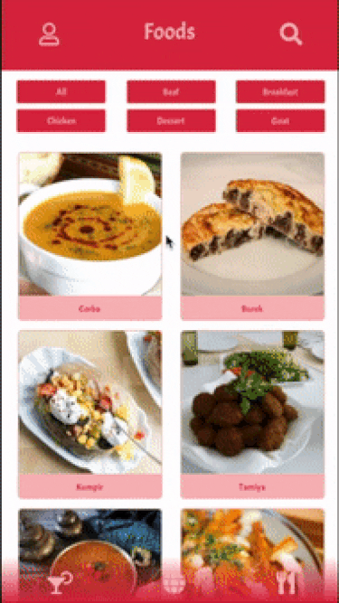

&nbsp;&nbsp;
# Bem vindo(a) ao projeto APP DE RECEITAS!

Este projeto foi desenvolvido em equipe, durante o curso de desenvolvimento de software na Trybe. Fique a vontade para contribuir e utilizar.
IMPORTANTE: Este não é um projeto final de curso, portanto, considere que o código contido nele não aprsenta as melhores práticas de mercado, mas é aceitável para uma pessoa em aprendizado. 

O app de receitas, utilizando o que há de mais moderno dentro do ecossistema React: Hooks e Context API!

Nela será possível ver, buscar, filtrar, favoritar e acompanhar o processo de preparação de receitas e drinks!

A base de dados serão 2 APIs distintas, uma para comidas e outra para bebidas.

O layout tem como foco dispositivos móveis, então todos os protótipos vão estar desenvolvidos em telas menores.

&nbsp;&nbsp;

## Instruções para visualizar o projeto

#### Através do terminal do seu computador:
1. Clone o repositório
    * `git clone git@github.com:ricardo-sousa-dev/_trybe-project-18-recipes-app.git`
  * Entre na pasta do repositório que você acabou de clonar:
    * `cd _trybe-project-18-recipes-app.git`

2. Instale as dependências e inicialize o projeto
  * Instale as dependências:
    * `npm install`
  * Inicialize o projeto:
    * `npm start` (uma nova página deve abrir no seu navegador com um texto simples)

&nbsp;&nbsp;
## APIs utilizadas

#### `TheMealDB API`

O [TheMealDB](https://www.themealdb.com/) é um banco de dados aberto, mantido pela comunidade, com receitas e ingredients de todo o mundo.

Os end-points são bastante ricos, você pode [vê-los aqui](https://www.themealdb.com/api.php)

#### `The CockTailDB API`

Bem similar (inclusive mantida pela mesma entidade) a TheMealDB API, só que focado em bebidas.

Os end-points também são bastante ricos, você pode [vê-los aqui](https://www.thecocktaildb.com/api.php)

&nbsp;&nbsp;
## Detalhes técnicos
&nbsp;
### Rotas

* Tela de login: `/`;
* Tela principal de receitas de comidas: `/comidas`;
* Tela principal de receitas de bebidas: `/bebidas`;
* Tela de detalhes de uma receita de comida: `/comidas/{id-da-receita}`;
* Tela de detalhes de uma receita de bebida: `/bebidas/{id-da-receita}`;
* Tela de receita em processo de comida: `/comidas/{id-da-receita}/in-progress`;
* Tela de receita em processo de bebida: `/bebidas/{id-da-receita}/in-progress`;
* Tela de explorar: `/explorar`;
* Tela de explorar comidas: `/explorar/comidas`;
* Tela de explorar bebidas: `/explorar/bebidas`;
* Tela de explorar comidas por ingrediente: `/explorar/comidas/ingredients`;
* Tela de explorar bebidas por ingrediente: `/explorar/bebidas/ingredients`;
* Tela de explorar comidas por local de origem: `/explorar/comidas/area`;
* Tela de perfil: `/perfil`;
* Tela de receitas feitas: `/receitas-feitas`;
* Tela de receitas favoritas: `/receitas-favoritas`.

&nbsp;
### localStorage

O uso de `localStorage` é utilizado para que as informações não se percam caso a pessoa atualize a página.

&nbsp;
### Bibliotecas

#### `clipboard-copy`

Para os componentes que contêm a funcionalidade de favoritar pratos ou bebidas, foi utilizada a biblioteca `clipboard-copy` para copiar as informações da receita. Essa biblioteca já vem instalada no projeto.

Para mais informações, consulte a [documentação](https://www.npmjs.com/package/clipboard-copy)

### `Bootstrap` 

Alguns elementos foram adicionados com a lib `Bootstrap`. 
Para mais informações, consulte a [documentação](https://react-bootstrap.github.io/components/buttons/):

&nbsp;
### Funcionalidades

Nesse projeto, a pessoa que estiver utilizando o app pode procurar uma receita especifica, explorar receitas baseado em diferentes critérios, favoritar e fazer as receitas entre outras funcionalidades.

As telas sofrem variações dependendo do tipo da receita (se é comida ou bebida, no caso).

#### `Tela de login`

#### `Barra de busca - Header`

#### `Menu inferior`

#### `Tela principal de receitas`

#### `Tela de detalhes de uma receita`
 
#### `Tela de receita em progresso`

#### `Tela de receitas feitas`

#### `Tela de receitas favoritas`

#### `Tela de explorar`

#### `Tela de explorar bebidas ou comidas`

#### `Tela de explorar ingredientes`

#### `Tela de explorar por local de origem/area`

#### `Tela de perfil`

&nbsp;
---
&nbsp;

Caso queira conversar a respeito do projeto, me envie um e-mail.  :)